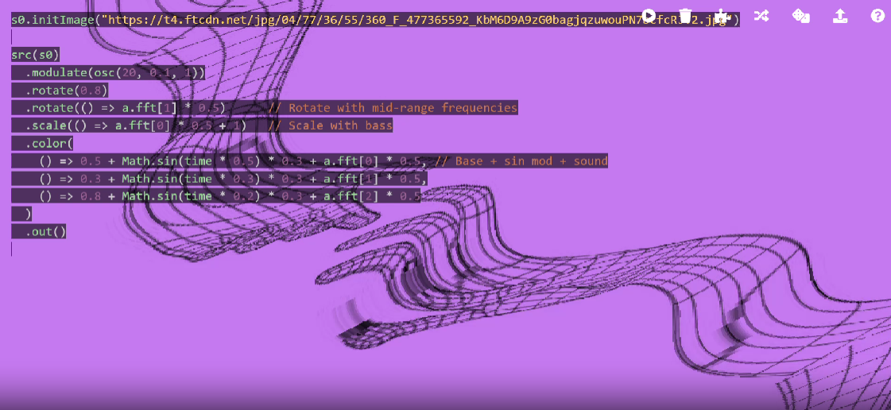
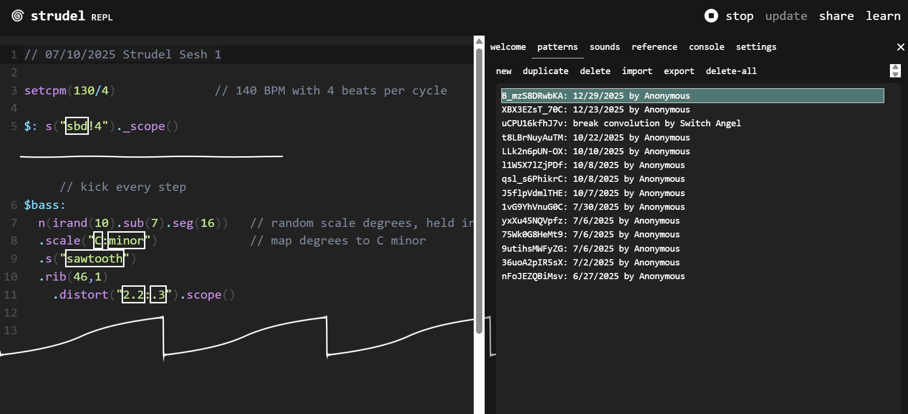

# Audiovisual Interactions: Hydra & Strudel

This project explores live coding for audiovisual performances using **Hydra** (for visuals) and **Strudel** (for music). Below you'll find an introduction to both tools, and instructions for using them both online and locally.

---

## What is Hydra?

**Hydra** is a live-coding platform for creating real-time visuals in the browser. It is inspired by analog video synthesis and allows you to write JavaScript code to generate and manipulate visuals, often in sync with music or audio input.

**Key Features:**
- Real-time, code-driven visuals
- Audio-reactive capabilities
- Runs in the browser (no install needed)
- Integrates with other live coding tools

**Official site:** [hydra.ojack.xyz](https://hydra.ojack.xyz/)

---

## What is Strudel?

**Strudel** is a browser-based live coding environment for music, inspired by TidalCycles. It lets you sequence samples, synths, and MIDI using a concise, pattern-based language.

**Key Features:**
- Pattern-based music sequencing
- Runs in the browser (no install needed)
- Supports samples, synths, and MIDI
- Integrates with visuals (e.g., Hydra)

**Official site:** [strudel.tidalcycles.org](https://strudel.tidalcycles.org/)

---

## Using Hydra and Strudel: Web Versions

### Hydra (Web)
1. Go to [hydra.ojack.xyz](https://hydra.ojack.xyz/)
2. Start coding in the editor on the left. Example code from this repo (see `Hydra Visuals/reaching_hands.js`) can be pasted directly.
3. Visual output appears on the right. You can use your microphone or audio input for sound-reactive visuals.

### Strudel (Web)
1. Go to [strudel.tidalcycles.org](https://strudel.tidalcycles.org/)
2. Paste or type code from the `Strudel REPL Mix Sessions` folder (e.g., `ses_1.js`, `ses_2.js`).
3. Press **Shift+Enter** to run a line or block. Music will play in your browser.
4. You can load samples, sequence patterns, and more.

---

## Running Locally

### Hydra (Locally)
Hydra is primarily browser-based, below is "reaching hands" my first experimental design illustrating basic hydray methods. The colours, warping and distance between the hands is controller through external audio via the system mic




You can run it locally:

1. **Clone the Hydra repo:**
	```
	git clone https://github.com/ojack/hydra.git
	```
2. **Install dependencies:**
	```
	cd hydra
	npm install
	```
3. **Start the local server:**
	```
	npm start
	```
4. Open [http://localhost:8080](http://localhost:8080) in your browser.

You can now copy code from this repo into the local Hydra editor.

### Strudel (Locally)

Strudel is a browser-based live coding environment for music, inspired by TidalCycles. It allows you to create complex musical patterns and sequences using concise code, supporting samples, synths, and MIDI. Strudel is ideal for algorithmic composition and live performance.



#### Example Sessions

- **Session 1 (`ses_1.js`)**: Demonstrates a basic drum pattern (kick every step) and a randomized bassline in C minor, using sawtooth synthesis and effects like distortion. The code uses Strudel's pattern language to generate evolving, rhythmic music.

- **Session 2 (`ses_2.js`)**: Loads breakbeat and pad samples, sets a custom gain curve, and sequences a breakbeat loop with effects like scrubbing and stereo panning (orbit). This session shows how to manipulate samples and apply effects for dynamic, electronic music textures.

Strudel can also be run locally:

1. **Clone the Strudel repo:**
	```
	git clone https://github.com/tidalcycles/strudel.git
	```
2. **Install dependencies:**
	```
	cd strudel
	npm install
	```
3. **Start the local server:**
	```
	npm run dev
	```
4. Open [http://localhost:5173](http://localhost:5173) (or as indicated in the terminal).

You can now paste code from the `Strudel REPL Mix Sessions` folder into the local Strudel editor.

---

## Project Structure

- `Hydra Visuals/` — Example Hydra visual scripts
- `Strudel REPL Mix Sessions/` — Example Strudel music sessions

---

## References

- [Hydra Documentation](https://hydra.ojack.xyz/docs/)
- [Strudel Documentation](https://strudel.tidalcycles.org/docs/)

Feel free to experiment and remix the provided code!
